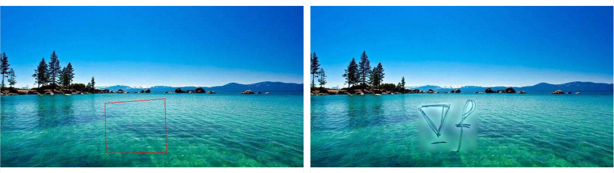
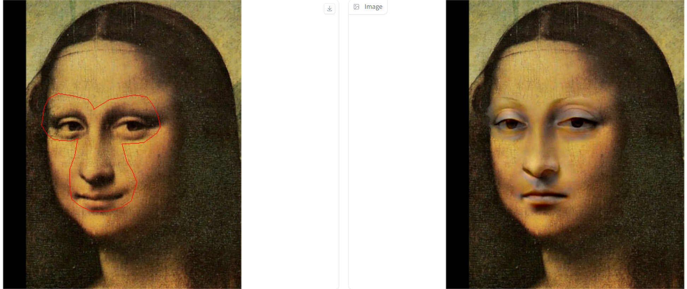
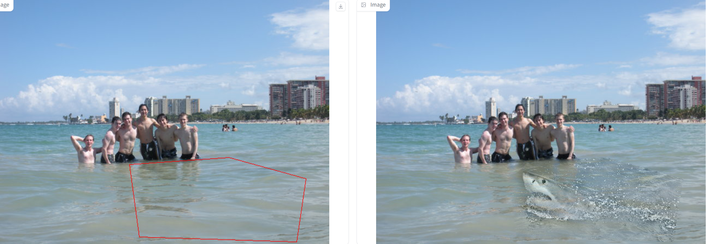

## Report
I finished the Polygon to Mask function and the Laplacian Distance Computation of 'run_blending_gradio.py'.
#### the Polygon to Mask function
This function generates a binary mask based on the given polygon vertices, where 0 represents the outside of the polygon and 255 represents the inside of the polygon.
#### the Laplacian Distance Computation
This function calculates the Laplacian loss between the foreground image and the blended image in the given mask area.
### Result
All  images can be viewed in the [data_poission folder](SA24001067_DIP/Homework2_DIPwithPyTorch/Poission/data_poission)

